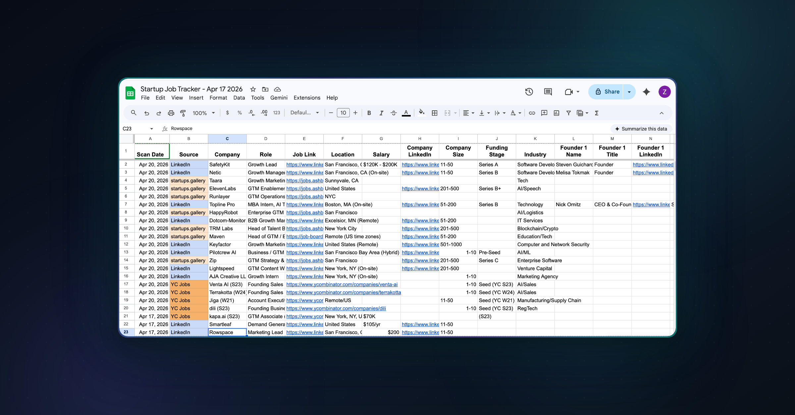

<div align="center">
  

  <br/>

  <h1>🚀 Startup Job Hunter</h1>
  <p><strong>AI-powered multi-platform startup job scraper — powered by <a href="https://www.sai.work/">Sai</a></strong></p>
  <p>Scans LinkedIn, startups.gallery, and YC Jobs in one command. Captures job details, founding team LinkedIn profiles, and resume-JD fit scores. Exports everything to a live Google Sheets tracker with incremental deduplication.</p>

  <br/>

  <a href="https://www.sai.work/"></a>
  <a href="https://www.sai.work/"></a>
  <a href="#platforms-scanned"></a>
  <a href="#what-you-get"></a>

</div>

---

## âš¡ Quick Start (3 Steps)

> **This is a Sai skill — not a Python script or CLI tool.**  
> It runs inside [Sai](https://www.sai.work/), your AI coworker that controls your computer autonomously.

### Step 1: Get Sai

👉 **Go to [sai.work](https://www.sai.work/) and sign up** — 7-day free trial, no credit card required.

Sai is an agentic AI coworker that lives on your computer. It can browse the web, control desktop apps, and automate complex multi-step workflows — like scanning 3 job platforms, researching founders on LinkedIn, scoring your resume against every JD, and building a structured Google Sheet tracker. All from a single prompt.

### Step 2: Import the Skill

1. Open the **Sai app** on your computer
2. Go to **Settings → Skills → Import Skill**
3. Import the `startup-job-hunter` skill from the skill registry (search for "startup job hunter")

That's it. No `pip install`, no API keys, no config files.

### Step 3: Run It

Open a chat with Sai and say something like:

```
Find me GTM and Growth Marketing startup jobs. Here's my resume.
```

**Attach your resume (PDF)** to the message, and Sai handles the rest — searching 3 platforms, filtering, deduplicating, researching companies, scoring fit, and building your tracker.

---

## 🎯 What This Skill Does

You give it a **role** (e.g., "GTM", "Growth Marketing", "Product") and a **resume**. It gives you back a fully populated Google Sheet with:

| What | How |
|------|-----|
| **70+ jobs per run** | Scanned across LinkedIn (24h), startups.gallery (7d), YC Jobs (7d) |
| **Smart keyword expansion** | "GTM" → searches 8+ variants (Growth Lead, Revenue Marketing, Demand Gen, etc.) |
| **Resume-JD fit scoring** | 0-100 score with 6-dimension breakdown per job |
| **Founding team contacts** | Founder names, titles, and LinkedIn profile URLs for companies <200 employees |
| **Incremental dedup** | Re-run daily — only new jobs get added, nothing duplicated |
| **Company research** | Size, industry, funding stage, LinkedIn page — all auto-collected |

---

## 📊 Google Sheets Output

Every run produces (or updates) a structured tracker:

| Column | Data |
|--------|------|
| Scan Date | When the job was found |
| Source | LinkedIn / startups.gallery / YC Jobs |
| Company | Company name |
| Role | Job title |
| Job Link | Direct link to apply |
| JD Summary | 2-3 sentence summary of the role |
| Location | City, state, or Remote |
| Salary Range | If publicly listed |
| Company LinkedIn | Link to company page |
| Company Size | e.g., "11-50 employees" |
| Funding Stage | Pre-Seed through Series C+ |
| Industry | e.g., "B2B SaaS", "Fintech" |
| Founder 1-3 | Name, Title, LinkedIn URL (×3 slots) |
| Fit Score | 0-100 resume match score |
| Fit Breakdown | `Role:22/25 \| Skills:16/20 \| ...` |
| Applied? | Your tracking column |
| Notes | YC batch, edge cases, etc. |

<div align="center">
  
  <br/>
  <em>Real output from a GTM job search — 19 new jobs found across 3 platforms</em>
</div>

---

## 🔍 Platforms Scanned

### LinkedIn Jobs (Past 24 Hours)
- Searches each keyword variant separately (LinkedIn's matching is literal)
- Paginates through up to 10 pages (250 jobs) per keyword
- Clicks into each job for full JD details and salary info
- Visits company page for size, then People page for founders

### startups.gallery (Past 7 Days)
- Searches all keyword variants with "Load More" pagination
- Captures external ATS links (Greenhouse, Ashby, Lever, etc.)
- Cross-references every company on LinkedIn for team data

### YC Jobs (Past 7 Days)  
- Maps roles to YC's category system (Sales, Product, etc.)
- Extracts YC batch info (W21, S24) and industry tags
- Finds founder LinkedIn profiles via YC page + Google search fallback

---

## 🎯 Resume-JD Fit Scoring

Every job gets scored across **6 dimensions**:

| Dimension | Weight | What It Measures |
|-----------|--------|-----------------|
| Role Relevance | 25% | Does the JD match your functional area? |
| Industry/Market Fit | 20% | B2B vs B2C alignment, vertical overlap |
| Skills Match | 20% | Required skills overlap with your resume |
| Seniority Alignment | 15% | Are you the right level for this role? |
| Tools & Platforms | 10% | Salesforce, HubSpot, Mixpanel, etc. |
| Domain Depth | 10% | Specific domain experience match |

**Score interpretation:**

| Score | Label | Action |
|-------|-------|--------|
| 80-100 | 🟢 Strong Fit | Apply immediately |
| 60-79 | 🟡 Moderate Fit | Apply with tailored resume |
| 40-59 | 🟠 Stretch | Only if mission is compelling |
| 0-39 | 🔴 Weak Fit | Skip unless you have a referral |

---

## 💬 Example Prompts

**Basic:**
```
Find startup jobs for Growth Marketing roles. Here's my resume.
```

**With existing tracker:**
```
Run the startup job hunter again. Update this sheet:
https://docs.google.com/spreadsheets/d/1khU...
```

**With location filter:**
```
Find GTM startup jobs in San Francisco. My resume is attached.
```

**Multiple roles:**
```
Search for Growth Lead, Product Marketing, and Demand Gen roles at startups.
```

---

## 🔄 Daily Usage Pattern

This skill is designed for **daily re-runs**:

1. **Day 1** — Full scan, creates the Google Sheet, finds ~40-70 jobs
2. **Day 2+** — Re-run with the same sheet link. Only NEW jobs get added (dedup by company + role)
3. **Track progress** — Use the "Applied?" column to mark jobs you've applied to

> 💡 **Pro tip:** Set up a [Sai workflow](https://www.sai.work/) to run this skill automatically every morning.

---

## ⚙️ Customization

| Parameter | Default | Options |
|-----------|---------|---------|
| Target roles | *(you specify)* | Any job function — GTM, Engineering, Design, Sales, etc. |
| Location | No filter | Any city, state, or "Remote" |
| Time window | LinkedIn: 24h, Others: 7d | Built-in to each platform |
| Resume | *(you upload)* | PDF format recommended |
| Google Sheet | Creates new | Or provide existing sheet URL |

---

## 🛡️ Rate Limiting & Safety

- **2-3 second delays** between LinkedIn page loads
- **Max 20 jobs per source** per keyword to avoid throttling
- **CAPTCHA detection** — if LinkedIn shows a challenge, Sai notes it and moves on
- **No data stored externally** — everything stays in your Google Sheet

---

## 🤔 Why Sai, Not Just a Script?

| | Python Script / API | Sai |
|---|---|---|
| **LinkedIn access** | ❌ Blocked by auth walls | ✅ Browses like you do |
| **Founder research** | ❌ Would need scraping infra | ✅ Visits profiles naturally |
| **JD parsing** | ❌ Regex / basic NLP | ✅ AI-native understanding |
| **Resume scoring** | ❌ Build your own model | ✅ Built-in 6-dimension eval |
| **Setup time** | Hours (APIs, auth, deploy) | 3 minutes (import skill, run) |
| **Maintenance** | You fix when sites change | Sai adapts automatically |

---

## 📁 Project Structure

```
startup-job-hunter/
├── README.md              # This file
├── assets/
│   └── cover.png          # Cover image / promo graphic
└── SKILL.md               # Sai skill definition (imported via Sai app)
```

---

## 📄 License

MIT — use it however you want.

---

<div align="center">
  <br/>
  <a href="https://www.sai.work/"><strong>Get started with Sai →</strong></a>
  <br/>
  <sub>7-day free trial · No credit card required · Works on Mac & Windows</sub>
  <br/><br/>
  <sub>Built with ❤️ using <a href="https://www.sai.work/">Sai by Simular</a></sub>
</div>
